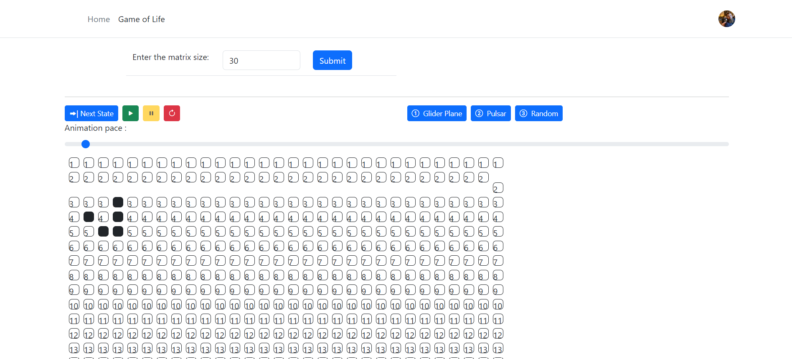
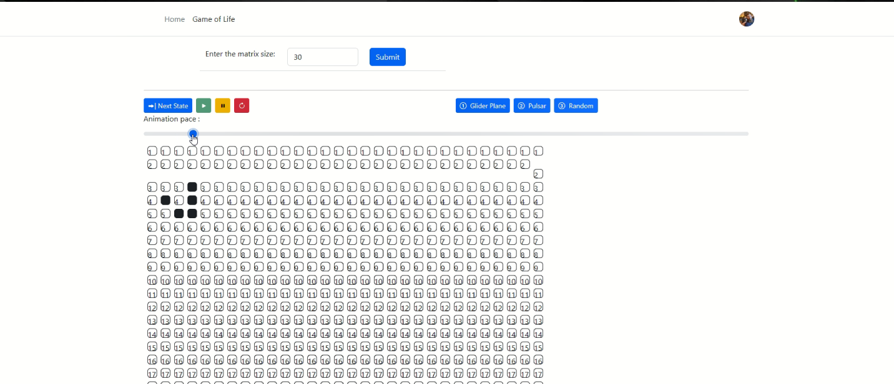

# Game of Life Game in Angular

## What is conway's game of life?
The Game of Life (an example of a cellular automaton) is played on an infinite two-dimensional rectangular grid of cells. Each cell can be either alive or dead. The status of each cell changes each turn of the game (also called a generation) depending on the statuses of that cell's 8 neighbors. Neighbors of a cell are cells that touch that cell, either horizontal, vertical, or diagonal from that cell.

The initial pattern is the first generation. The second generation evolves from applying the rules simultaneously to every cell on the game board, i.e. births and deaths happen simultaneously. Afterwards, the rules are iteratively applied to create future generations. For each generation of the game, a cell's status in the next generation is determined by a set of rules. These simple rules are as follows:

If the cell is alive, then it stays alive if it has either 2 or 3 live neighbors
If the cell is dead, then it springs to life only in the case that it has 3 live neighbors
There are, of course, as many variations to these rules as there are different combinations of numbers to use for determining when cells live or die. Conway tried many of these different variants before settling on these specific rules. Some of these variations cause the populations to quickly die out, and others expand without limit to fill up the entire universe, or some large portion thereof. The rules above are very close to the boundary between these two regions of rules, and knowing what we know about other chaotic systems, you might expect to find the most complex and interesting patterns at this boundary, where the opposing forces of runaway expansion and death carefully balance each other. Conway carefully examined various rule combinations according to the following three criteria:

There should be no initial pattern for which there is a simple proof that the population can grow without limit.
There should be initial patterns that apparently do grow without limit.
There should be simple initial patterns that grow and change for a considerable period of time before coming to an end in the following possible ways:
Fading away completely (from overcrowding or from becoming too sparse)
Settling into a stable configuration that remains unchanged thereafter, or entering an oscillating phase in which they repeat an endless cycle of two or more periods.

Reference: https://pi.math.cornell.edu/~lipa/mec/lesson6.html 

## About angular app implementation of conway's game of life

Each cell is a separate component of angular. The grid is component that contains dynamic number of component inside it. Each cell component has is its own state if it is alive or not. It also contains the knowledge about surrounding cell's state.

On starting generation, each cell calculates it's own next generation state.

## Demo

